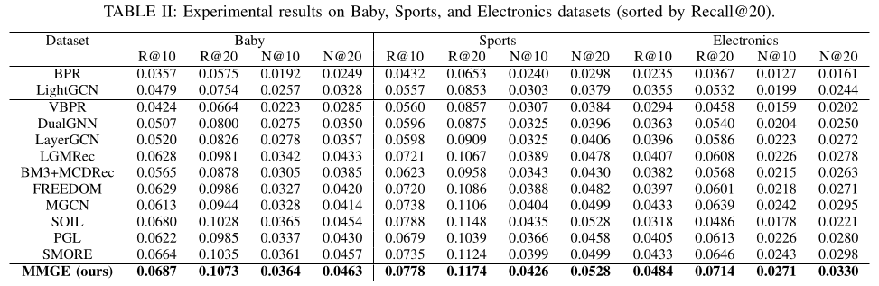

# MMGE: A Multi-Modal Graph Enhancement Recommendation Framework

<!-- PROJECT LOGO -->

## Introduction

This is the Pytorch implementation for our MMGE paper:

>MMGE: A Multi-Modal Graph Enhancement Recommendation Framework

## Environment Requirement
- python 3.12.7
- Pytorch 2.6.0

## Dataset

We provide four processed datasets: Baby, Sports, Electronics.

Download from Google Drive: [Baby/Sports/Electronics](https://drive.google.com/file/d/1VfcXxQ6fuxqzxvV3LE7x4ubvTwoOIkHU/view?usp=drive_link)

## Training
  ```
  cd ./src
  python main.py
  ```
## Performance Comparison



## Acknowledgement
The structure of this code is  based on [MMRec](https://github.com/enoche/MMRec). Thank for their work.
